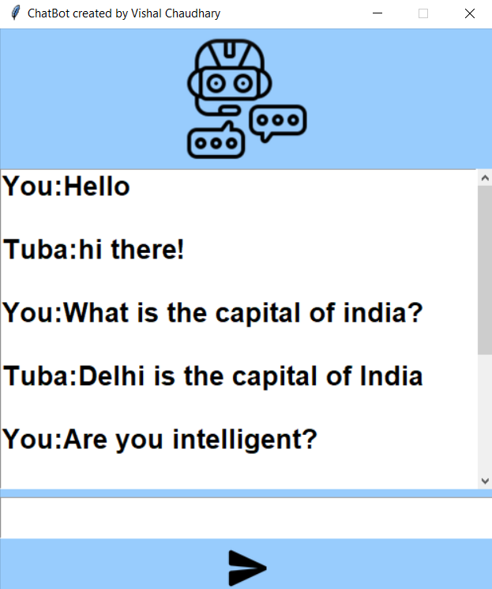
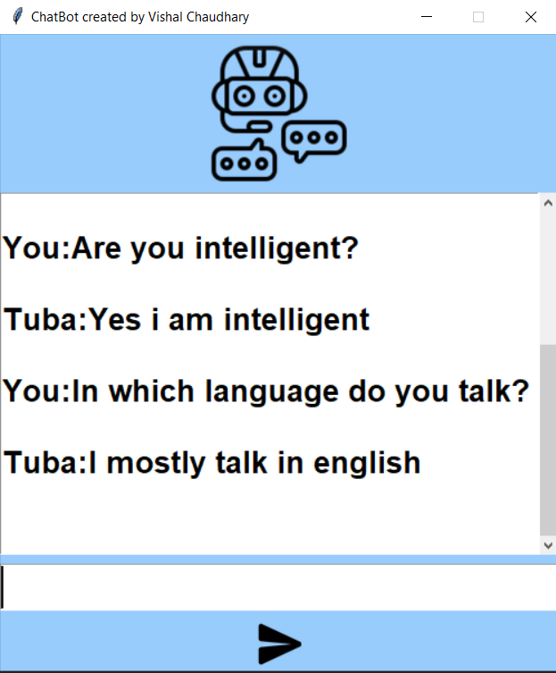

# ChatBot_Project
<b>I have created a GUI based ChatBot using tkinter and Training was done with the help of inbuilt python libraries on a customized dataset.<b>

# Here are the some snapshots of the chatbot working:-

 
